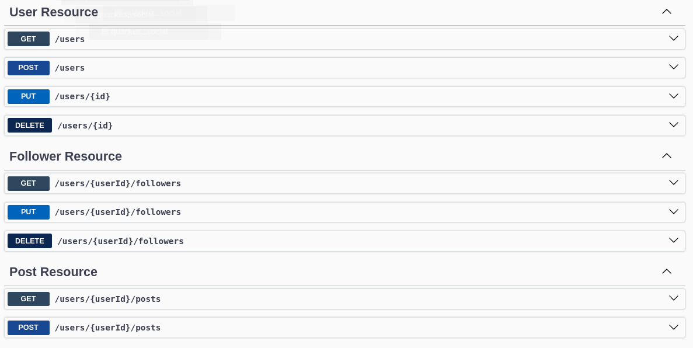

# Api Social Quarkus 🌐

Essa é uma api construída em Java utilizando o framework Quarkus.

# Resumo
- Api Usuários: Cadastrar um usuário, listar usuários e demais operações.
####
- Api Posts: Postagens de usuários, ordenadas de acordo com data e hora. 
####
- Api Followers: Usuários podem ter seguidores, as postagens só podem ser visualizadas pelos seguidores. Podendo também deixar de seguir um usuário.

# Executar o projeto

- Instale o quarkus https://quarkus.io/get-started/.
- Para executar o projeto, basta rodar o comando **quarkus dev** via terminal.

# Como usar?

Essa API foi documentada com Swagger, a partir da rota raiz: [localhost:8080/q/swagger-ui/](http://localhost:8080/q/swagger-ui/), você pode realizar os testes dos endpoints da aplicação.

